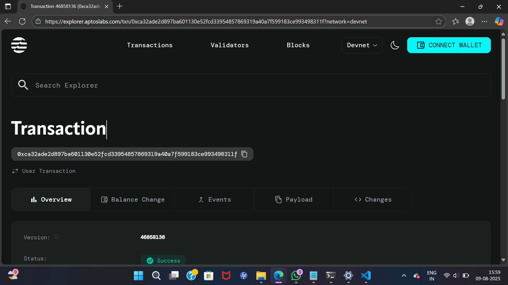

# Allow List Management Smart Contract

## Project Description

The Allow List Management smart contract is a decentralized solution built on the Aptos blockchain that enables dynamic management of address allowlists with time-based expiration functionality. This contract allows administrators to maintain a curated list of approved addresses while automatically enforcing expiration dates to ensure time-bound access control.

## Project Vision

Our vision is to provide a robust, secure, and efficient allowlist management system that empowers projects to implement sophisticated access control mechanisms. By combining blockchain immutability with flexible expiration management, we aim to create a foundational tool that can be integrated into various DeFi protocols, NFT projects, and decentralized applications requiring controlled access.

The contract serves as a building block for creating more complex permission systems while maintaining simplicity and gas efficiency. We envision this as part of a larger ecosystem where access control becomes more granular, automated, and trustless.

## Key Features

- **Dynamic Address Management**: Add addresses to the allowlist with custom expiration timestamps
- **Automatic Expiration**: Built-in time-based validation ensures expired entries are automatically considered invalid
- **Owner-Controlled Access**: Only the contract owner can modify the allowlist, ensuring security and preventing unauthorized changes
- **Efficient Validation**: Optimized checking mechanism to verify if an address is currently allowed
- **Gas Optimized**: Lightweight implementation designed for minimal transaction costs
- **Time-Based Security**: Leverages Aptos timestamp functionality for reliable time validation
- **Scalable Design**: Vector-based storage allows for flexible allowlist sizes
- **Error Handling**: Comprehensive error codes for debugging and integration purposes

## Future Scope

- **Multi-Tier Allowlists**: Implement different permission levels with varying access rights
- **Bulk Operations**: Add functionality for batch adding/removing multiple addresses
- **Allowlist Categories**: Support for multiple allowlist types within a single contract
- **Integration APIs**: Develop standardized interfaces for easy integration with other smart contracts
- **Advanced Expiration Logic**: Support for renewable subscriptions and automatic extensions
- **Governance Integration**: Allow DAO-based voting for allowlist modifications
- **Analytics Dashboard**: On-chain tracking of allowlist usage and statistics
- **Cross-Chain Compatibility**: Extend functionality to work across multiple blockchain networks
- **Whitelist Templates**: Pre-configured allowlist setups for common use cases
- **Emergency Controls**: Implement pause/unpause functionality for security purposes

### Module Information

- **Module Name**: `MyModule::AllowlistManager`
- **Network**: Aptos Devnet
- **Account Address**: `0xc6dfa158f875f6ce124b745024eb5cbe900deb3f88fa1fe57954e6c9aa1b407a`

### Smart Contract Functions

#### 1. `initialize_allowlist(owner: &signer)`

- **Purpose**: Initializes the allowlist manager for the contract owner
- **Access**: Public function
- **Parameters**:
  - `owner`: Signer reference for the account initializing the allowlist
- **Usage**: Must be called once before using other functions

#### 2. `add_to_allowlist(owner: &signer, target_address: address, expiration_timestamp: u64)`

- **Purpose**: Adds an address to the allowlist with a specified expiration time
- **Access**: Owner-only function
- **Parameters**:
  - `owner`: Signer reference for the allowlist owner
  - `target_address`: Address to be added to the allowlist
  - `expiration_timestamp`: Unix timestamp when the allowlist entry expires
- **Security**: Only the contract owner can call this function

#### 3. `is_address_allowed(owner_addr: address, target_address: address): bool`

- **Purpose**: Checks if an address is currently in the allowlist and not expired
- **Access**: Public view function
- **Parameters**:
  - `owner_addr`: Address of the allowlist owner
  - `target_address`: Address to check for allowlist status
- **Returns**: Boolean indicating if the address is allowed and not expired

### Error Codes

- `E_ALLOWLIST_NOT_FOUND (1)`: Allowlist manager not found for the given address
- `E_ADDRESS_NOT_IN_ALLOWLIST (2)`: Address is not present in the allowlist
- `E_ALLOWLIST_EXPIRED (3)`: Address allowlist entry has expired
- `E_UNAUTHORIZED (4)`: Caller is not authorized to perform this action

### Dependencies

- `aptos_framework::signer`: For account signature verification
- `aptos_framework::timestamp`: For time-based expiration logic
- `std::vector`: For dynamic storage of allowlist entries

### Data Structures

#### AllowlistEntry

```move
struct AllowlistEntry has store {
    address: address,           // The allowlisted address
    expiration_time: u64,      // Unix timestamp for expiration
}
```

#### AllowlistManager

```move
struct AllowlistManager has store, key {
    owner: address,                      // Owner of the allowlist
    entries: vector<AllowlistEntry>,     // Vector of allowlist entries
}
```

### Deployment Instructions

1. **Initialize Aptos CLI**:

   ```bash
   aptos init
   ```

2. **Configure Move.toml** with your account address:

   ```toml
   [addresses]
   MyModule = "YOUR_ACCOUNT_ADDRESS"
   ```

3. **Deploy the contract**:

   ```bash
   aptos move deploy
   ```

4. **Initialize the allowlist** (after deployment):
   ```bash
   aptos move run --function-id YOUR_ADDRESS::AllowlistManager::initialize_allowlist
   ```

### Usage Examples

After deployment, you can interact with the contract using the Aptos CLI or integrate it into your dApp for access control mechanisms such as:

- NFT minting allowlists
- DeFi protocol participation
- Governance voting eligibility
- Premium feature access
- Time-limited promotions

## Contract Details

0xca32ade2d897ba601130e52fcd33954857869319a40a7f599183ce993498311f

